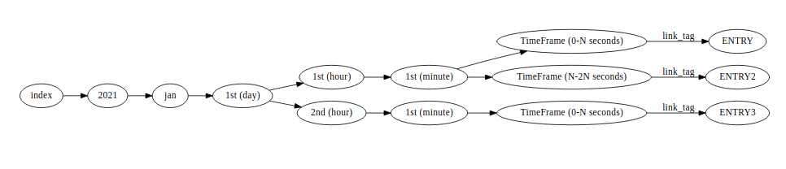

# Holochain-Time-Index

## Purpose

This DHT aims to be one solution (of many) to the DHT hostpotting problem that can occur in holochain DHT's when many links are made from one entry.
This hotspotting occurs as the original author (and their surrounding hash neighbourhood?) of an entry is responsible for storing and resolving all links from the given authored entry. As a result if a given entry becomes very popular then it can be left up to one or a few nodes to handle all traffic flowing through this part of the DHT.

## Function

The main component that allows the mitigation of DHT hotspots are: 
1) time delimited indexing.
2) agent focused validation that occurs on each index.

### Time Delimited Indexing

This crate exposes an `index_entry(index: String, entry: T, link_tag: Into<LinkTag>)` function. This function indexes the submitted entry into a time b-tree. The b-tree looks something like the following:

In the above example we are indexing 3 entries. It should be simple to follow the time tree and see how this tree can be used to locate an entry in time; but we have also introduced a new concept: TimeFrame. 
TimeFrame is the last piece of the path where entries get linked. This allows for the specification of a time frame that is greater than one unit of the "parent" time. This is useful when you want to link at a fidelity that is not offered by the ordinary time data; i.e index links at every 30 second chunk vs every minute or link to every 10 minute chunk vs every hour.
This time frame can be set by adding the `ENFORCE_SPAM_LIMIT` to host DNA's properties.

Indexes into time tree occur based on the value received from `IndexableEntry::entry_time(&self)` trait function that should be derive on the entry type you wish to index. 

### Agent Link Validation

For any given index an **agent** cannot make more than `ENFORCE_SPAM_LIMIT` links. This value is set by the properties of the host DNA which is using this library; this library will just read host DNA's properties and set its internal variables based on what it finds.

### DNA Lifecycle

This DNA's variables mentioned above are expected to be static. That means its expected that the: `ENFORCE_SPAM_LIMIT` & `MAX_CHUNK_INTERVAL` should stay the same throughout the lifetime of the DHT. This is done to make validation possible in situations where DHT sharding could occur. 
If limits are able to change; we have no way to reliably know if an agent is operating on old limits by consequence of being out of touch with latest DHT state or if the agent is malicious and pretending they do not see the new limits. You can see this being an especially big problem when you have two areas of the DHT "merging" and the "outdated" area of the DHT having all of its links in-validated by the agents in the more current of the DHT space.

Currently if we wish to update limits we will create a new DNA/DHT and link to the new one from the current.

If you can guarantee that fragmentation of the DHT will not happen then its possible to implement limit updates. If this is something you wish to do its recommended that you enforce new limits at some given chunk in the future rather than instantly. This allows you to (hopefully) give enough time for other DHT agents to receive new limit information before its enforced.   

### Exposed Functions

This DNA exposes a few helper functions to make integrating with this time series data easy. Functions are:

`get_indexes_between()`: Gets links between two time periods
`get_current_index()`: Gets links on current index period
`get_most_recent_indexes()`: Gets the most recent links
`index_entry()`: Indexes an entry into time tree

### hApp Usage

Using the above methods its possible to build an application which places an emphasis on time ordered data (such as a group DM or news feed). Or you can use the time ordered nature of the data as a natural pagination for larger queries where you may wish to aggregate data over a given time period and then perform some further computations over it.

## Status/TODO

- [x] Basic public lib functions implemented & tested
- [x] Crates own internal error type
- [x] Basic performance optimizations for search between function
- [ ] Basic performance optimizations for local vec iteration 
- [ ] Advanced Performance optimizations for search functions
- [ ] Advanced testing of DNA functioning
- [x] Lib's variables derived from host DNA properties (blocked until HDK support)
- [ ] Validation functions for links made at indexes
- [ ] Validation functions for time b-tree shape & structure
- [ ] Limit of returned links in public functions

### Limitations

- You cannot index at time before UNIX epoch (00:00:00 UTC on 1 January 1970)
- Limit & interval variables must be static throughout lifetime of DHT
- Calling `get_indexes_between()` with a large from & until value will take a long time to return